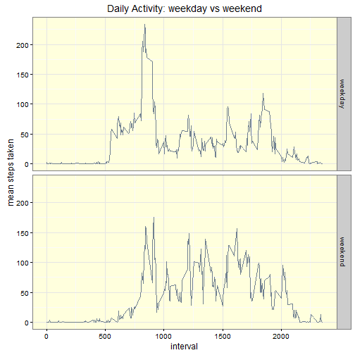

## Loading and preprocessing the data

```r
if (!file.exists("activity.csv")) {
  unzip("./activity.zip")
}
activity <- read.csv("activity.csv")
activity$date <- as.Date(activity$date)

#load libraries here
library(ggplot2)
library(Hmisc)

theme_set(theme_bw() + theme(panel.background=element_rect(fill ="#ffffdd")))

#set the random seed
set.seed(220847)
```

The data for this assignment is a count of steps, 
taken over a sixty day period
for an anonymous individual. 
The step counts were taken using a personal activity monitor device.
This device collects data at 5 minute intervals 
through out the day. 

* Dataset: [Activity monitoring data](https://d396qusza40orc.cloudfront.net/repdata%2Fdata%2Factivity.zip) [52K]

The variables included in this dataset are:

* **steps**: Number of steps taking in a 5-minute interval (missing
    values are coded as `NA`)

* **date**: The date on which the measurement was taken in YYYY-MM-DD
    format

* **interval**: Identifier for the 5-minute interval in which
    measurement was taken

## What is mean total number of steps taken per day?

```r
# calculate the total number of steps per day
steps_per_day <- aggregate(steps ~ date, data=activity, sum)

# make a histogram of the total number of steps taken each day
ggplot(steps_per_day, aes(x=steps)) +
  geom_histogram(fill="slategray", binwidth=2000) +
  xlab("Number of Steps Taken") +
  ylab("days") +
  ggtitle("Distribution of Steps per Day")
```

 

What makes this a histogram and not a bar chart?
A histogram shows the distribution of a variable. 
In this case the variable is 'steps' or the number of steps taken in a day.
The chart shows that most days that number is between 10,000 and 15,000, 
but it can vary between zero and over 20,000.

[http://www.forbes.com/sites/naomirobbins/2012/01/04/a-histogram-is-not-a-bar-chart/]


```r
# calculate and report the mean and median of the total number of steps taken per day
s <-data.frame(
  mean = mean(steps_per_day$steps), 
  median = quantile(steps_per_day$steps, probs = 0.5))
row.names(s) <- "steps per day"
s
```

```
##                   mean median
## steps per day 10766.19  10765
```

## What is the average daily activity pattern?

```r
# Make a time series plot (i.e. `type = "l"`) 
# of the 5-minute interval (x-axis) 
# and the average number of steps taken, 
# averaged across all days (y-axis)
by_interval <- aggregate(steps ~ interval, activity, mean)

# time series plot x=interval y=steps
ggplot(by_interval, aes(x=interval, y=steps)) +
  geom_line(size=1, col="slategray") +
  ylab("Mean of Steps Taken") +
  ggtitle("Average Daily Activity")
```

 

```r
# Which 5-minute interval, 
# on average across all the days in the dataset, 
# contains the maximum number of steps?
max_steps <- max(by_interval$steps)
by_interval[by_interval$steps == max_steps,]
```

```
##     interval    steps
## 104      835 206.1698
```

## Imputing missing values
There are several intervals with no observations. What effect does this have on the data?


```r
# How many missing values are in the dataset?
data.frame(observations=length(activity$steps), 
           count.na=sum(is.na(activity$steps)), 
           pct=mean(is.na(activity$steps))*100)
```

```
##   observations count.na      pct
## 1        17568     2304 13.11475
```

```r
# Make a copy of the activity data frame
activity2 <- activity
# Impute steps using random values based on the mean
guess <- rnorm(sum(is.na(activity$steps)),
               mean(activity$steps, na.rm = T),
               5)
activity2$isteps <- impute(activity$steps, guess)

imputed <- aggregate(isteps ~ date, activity2, sum)
ggplot(imputed, aes(x=isteps)) +
  geom_histogram(fill="slategray", binwidth=2000) +
  xlab("Number of Steps Taken") +
  ylab("days") +
  ggtitle("Distribution of Steps per Day")
```

 

```r
# Calculate and report the **mean** and **median** total number of steps taken per day.
# Do these values differ from the estimates from the first part of the assignment? 
# What is the impact of imputing missing data on the estimates of the total daily number of steps?
s2 <-data.frame(
  mean = mean(imputed$isteps), 
  median = quantile(imputed$isteps, probs = 0.5))
row.names(s2) <- "steps per day (imputed)"
rbind(s, s2)
```

```
##                             mean   median
## steps per day           10766.19 10765.00
## steps per day (imputed) 10765.89 10785.71
```

```r
#activity2$guess <- is.imputed(activity2$isteps)
#ggplot(activity2, aes(x=interval, y=isteps)) +
#  geom_point(aes(color=guess, group=guess))
```

I considered using the daily mean to replace NA values 
but I found that instead of brief gaps in the data
there were whole days missing. 
Instead I chose to replace the missing values 
with random normal values centered on the overall mean.
The imputed values decreased the mean slightly and increased the median.

[http://stackoverflow.com/questions/13114812/imputation-in-r]

[https://cran.r-project.org/web/packages/Hmisc/Hmisc.pdf]


## Are there differences in activity patterns between weekdays and weekends?

```r
# Add a new variable based on the date
# weekday or weekend?
activity$wkday <- sapply(activity$date, function(d) 
                           if (weekdays(d) %in% c("Saturday", "Sunday"))
                             "weekend"  else "weekday")

# get the mean steps taken per interval for each wkday category
weekday <- aggregate(steps ~ interval, activity[activity$wkday=="weekday",], mean)
weekend <- aggregate(steps ~ interval, activity[activity$wkday=="weekend",], mean)

# build a long form dataset for plotting
weekday$dy <- "weekday"
weekend$dy <- "weekend"
lform <- rbind(weekday, weekend)

ggplot(lform, aes(x=interval, y=steps)) +
  geom_line(color="slategray") +
  facet_grid(dy ~ .) +
  ylab("mean steps taken") +
  ggtitle("Daily Activity: weekday vs weekend")
```

 

## Additional Resources

[http://www.cookbook-r.com/Graphs/Colors_(ggplot2)/]

[http://www.cookbook-r.com/Graphs/Legends_(ggplot2)/]
