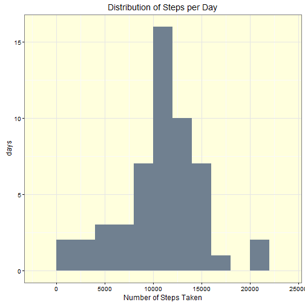
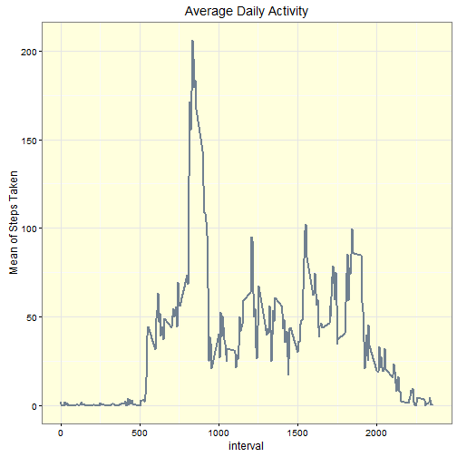
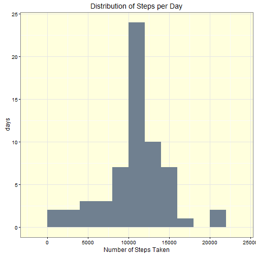

## Loading and preprocessing the data

```r
if (!file.exists("activity.csv")) {
  unzip("./activity.zip")
}
activity <- read.csv("activity.csv")
activity$date <- as.Date(activity$date)

#load libraries here
library(Hmisc)
library(ggplot2)

theme_set(theme_bw() + theme(panel.background=element_rect(fill ="#ffffdd")))

#set the random seed
set.seed(220847)
```

## What is mean total number of steps taken per day?

```r
# calculate the total number of steps per day
steps_per_day <- aggregate(steps ~ date, data=activity, sum)

# make a histogram of the total number of steps taken each day
ggplot(steps_per_day, aes(x=steps)) +
  geom_histogram(fill="slategray", binwidth=2000) +
  xlab("Number of Steps Taken") +
  ylab("days") +
  ggtitle("Distribution of Steps per Day")
```

 

What makes this a histogram and not a bar chart?
A histogram shows the distribution of a variable. 
In this case the variable is 'steps' or the number of steps taken in a day.
The chart shows that most days that number is between 10,000 and 15,000, 
but it can vary between zero and over 20,000.

[http://www.forbes.com/sites/naomirobbins/2012/01/04/a-histogram-is-not-a-bar-chart/]


```r
# calculate and report the mean and median of the total number of steps taken per day
s <-data.frame(
  mean = mean(steps_per_day$steps), 
  median = quantile(steps_per_day$steps, probs = 0.5))
row.names(s) <- "steps per day"
s
```

```
##                   mean median
## steps per day 10766.19  10765
```

## What is the average daily activity pattern?

```r
# Make a time series plot (i.e. `type = "l"`) 
# of the 5-minute interval (x-axis) 
# and the average number of steps taken, 
# averaged across all days (y-axis)
by_interval <- aggregate(steps ~ interval, activity, mean)

# time series plot x=interval y=steps
ggplot(by_interval, aes(x=interval, y=steps)) +
  geom_line(size=1, col="slategray") +
  ylab("Mean of Steps Taken") +
  ggtitle("Average Daily Activity")
```

 

```r
# Which 5-minute interval, 
# on average across all the days in the dataset, 
# contains the maximum number of steps?
max_steps <- max(by_interval$steps)
by_interval[by_interval$steps == max_steps,]
```

```
##     interval    steps
## 104      835 206.1698
```

## Imputing missing values
There are several intervals with no observations. What effect does this have on the data?


```r
# How many missing values are in the dataset?
data.frame(observations=length(activity$steps), 
           count.na=sum(is.na(activity$steps)), 
           pct=mean(is.na(activity$steps))*100)
```

```
##   observations count.na      pct
## 1        17568     2304 13.11475
```

```r
# Make a copy of the activity data frame
activity2 <- activity
# Impute using the mean of all steps
activity2$mean_steps <- impute(activity$steps, mean)
# Impute using "random"
activity2$random_steps <- impute(activity$steps, "random")
imputed <- aggregate(cbind(mean_steps, random_steps) ~ interval, activity2, mean)
splom(imputed[2:3], xlab="Imputed Steps")
```

 

```r
#par(mfrow=c(1,2))
#with(imputed, plot(mean_steps ~ interval), plot(random_steps ~ interval))
```

[http://stackoverflow.com/questions/13114812/imputation-in-r]

[https://cran.r-project.org/web/packages/Hmisc/Hmisc.pdf]

[http://www.cookbook-r.com/Graphs/Legends_(ggplot2)/]

## Are there differences in activity patterns between weekdays and weekends?
